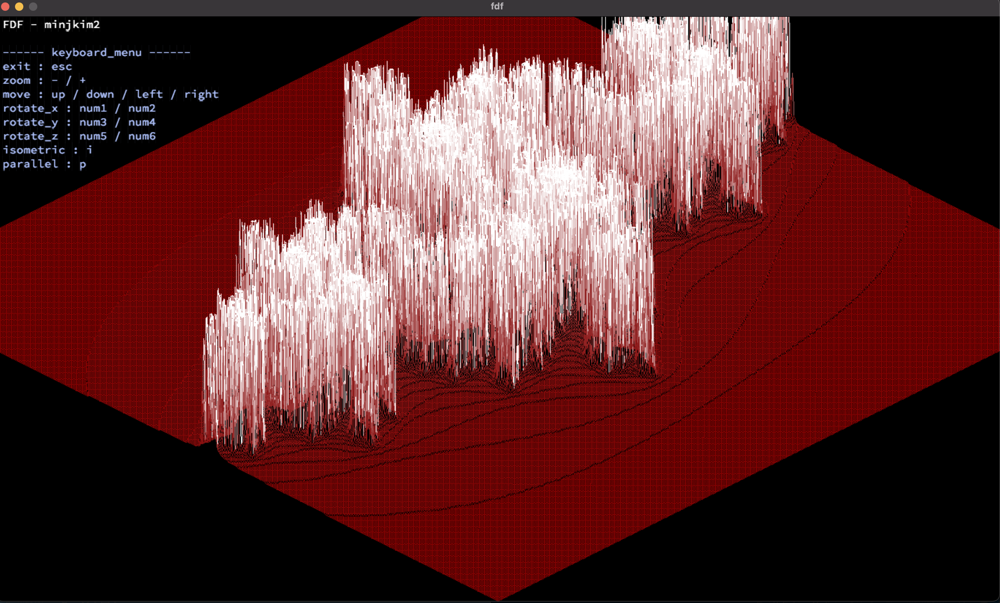

# FDF - @42Born2Code

### **Contents**
------------
> + [Subject](#Subject)

> + [Makefile](#Makefile)

> + [후기](#후기)

### **Subject**
---
MANDATORY   

- MinilibX를 사용하여 주어진 map을 parsing하고, isometric projection을 이용하여 화면에 그리기.  

BONUS
- zoom in, zoom out, shift
- rotate
- other projection.
  
### **Makefile**
---
fdf 파일 생성 && 하위 라이브러리 make

    make

오브젝트 파일 삭제

    make clean

### **후기**
----
1. 어려웠던 점
   - isometric projection과 회전에 대하여 검색하면서 공식은 Githhub로 찾을 수 있엇지만, 어떻게 해서 회전이 되는것이며, 이 공식은 어떻게 도출이 되었는가? 에 관한 고민.
   - pixel을 일일이 찍는 방법, image 주소에 pixel을 미리 찍어놓고 image로 출력을 하는 방법에 대한 고민
   - 이동, 확대/축소 기능을 구현하는 도중 화면을 벗어나는 부분들이 반대쪽에서 튀어나오는 문제.
   - DDA algorithm, Bresenham's line algorithm
  
2. 후기
   - 첫번째 graphic과제 였던만큼 생소한 분야였고, 수학에 대해서 공부를 많이했던 과제였다.
   - 공식이 도출되는 과정을 회전변환행렬을 통해서 해결하였고, 궁금증을 해결 할 때 기쁨을 많이 느꼈다.
   - 과제를 제출할때는, pixel로 찍어서 제출했지만, 회전, 축소/확대 시 수행능력이 너무 떨어져서 image 로 출력하게끔 개선하였다.

3. 개선한 부분
   - img를 사용하여 화면에 출력을 하였다. -> 크기가 큰 파일들도 확대 축소, 회전, 이동을 하였을때 퍼포먼스가 잘 나왔다.
   - 키보드를 눌렀을때, 기능들이 작동하게 하였는데, 키 셋팅에 관한 user guide를 왼쪽 상단에 추가하였다.
