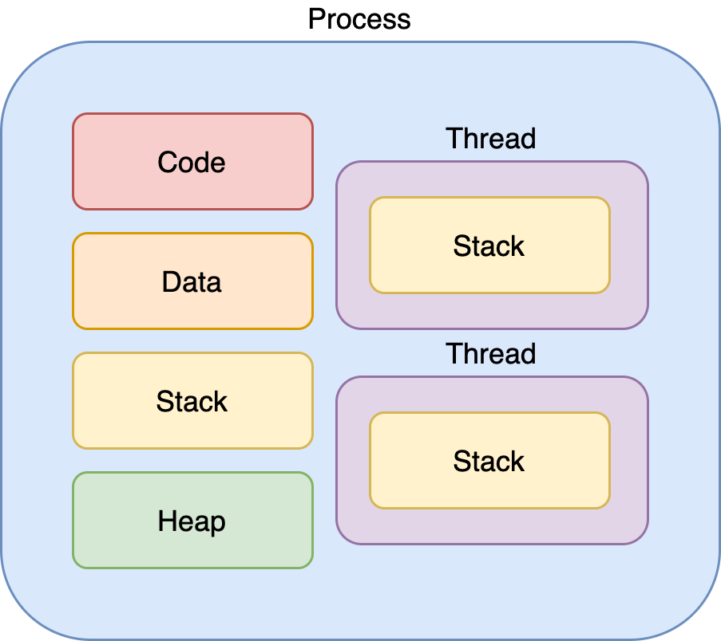

# Philosophers

### `time_t`
- ISO C 라이브러리에서 시스템 시간을 저장하도록 정의된 자료형이다.
- 표준 함수인 `time()`의 리턴값
- `<time.h>` 헤더 파일에서 정의된다.
- UNIX 나 POSIX 호환 운영체제에서는 time_t를 32, 64비트 부호있는 정수형으로 정의
- 1970-01-01 00:00:00 UTC 이후 경과한 초를 담고 있다.
### `POSIX`
- Portable Operating System Interface
- 서로 다른 UNIX OS의 공통 API를 정리하여 이식성이 높은 유닉스 응용 프로그램을 개발하기 위한 목적 IEEE가 정한 Application Interface 규격.
- 내용으로는 C언어 인터페이스 시스템콜, 프로세스 환경, 파일과 디렉터리, 데이터베이스, tar 등 다양한 분야.
### `Program`
- 어떤 작업을 하 기 위해 실행할 수 있는 파일 또는 프로그램
### `Process`
- In computing, a process is the instance of a computer program that is being executed by one or many threads.
- 메모리에 적재되고 CPU 자원을 할당 받아 프로그램이 실행되고 있는 상태
### `Thread`
- 프로세스 내에서 실행되는 여러 흐름의 단위.
- 장점
    - context switching 시간이 짧다.
    - 메모리 공유 → 시스템 자원 소모가 줄어든다.
    - 응답시간 단축    

        
- Thread는 code / data / heap 영역을 공유한다.
- stack 영역은 공유하지 않는다.
### `Pthread`
- POSIX Thread
- 병렬적(parellel)으로 작동하는 소프트웨어 작성을 위해서 제공되는 표준 API
