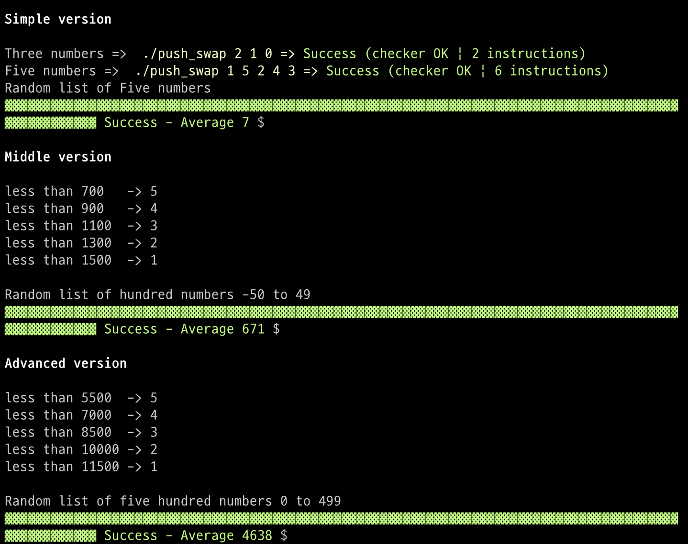

# Push_Swap - @42Born2Code

### **Contents**
------------
> + [Subject](#Subject)

> + [Makefile](#Makefile)

### **Subject**
---
MANDATORY   

- sort parameters using specific operations (sa, pa ...)

BONUS
- Make a Checker (check if parameter is sorted)
  
### **Makefile**
---
create push_swap & checker   

	make

